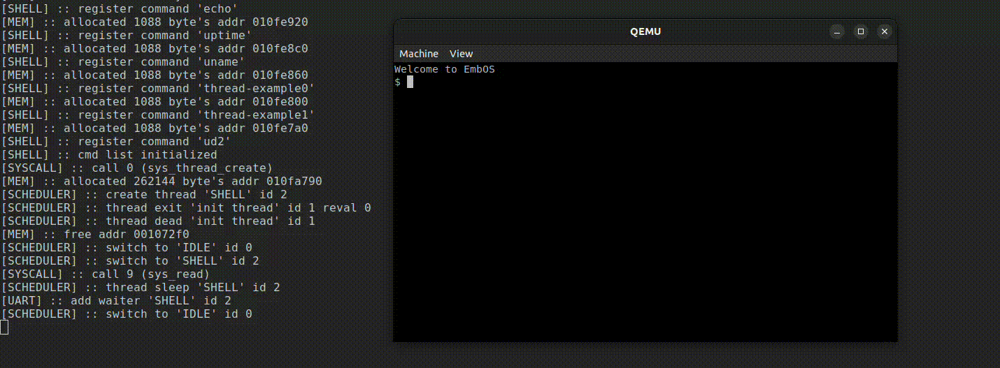

# EmbOS
__EmbOS__ - Простая минималистичная многопоточная операционная система для обучения, написанная на языке си и ассемблера (at&t) для архитектуры х64-86, ОС работает без использования механизма трансляции адресов (без виртуальной памяти) всегда работает на нулевом уровне привилегий с использованием системных вызовов, все программы непосредственно встроены в ядро и являются отдельными потоками, способная компилироваться для O2/O3.

Является второй ОС из серии руководств по программированию операционных систем (дружелюбна к новичкам в программировании). В процессе чтения руководства вы дальше продолжите знакомиться с архитектурой процессора x64-86, перейдёте уже к знакомству работы процессора в защищенном режиме вкратце узнаете о спецификации мультизагрузки-1, познакомитесь с такими компонентами процессора как: программируемый контроллер прерываний (i8259), программируемый таймер (i8254), познакомитесь с протоколом UART и напишите свой первый драйвер (rs232)

Так же научитесь правильной обработки прерываний, обработке системных вызовов и вложенных системных вызовов. Узнаете о работе потоков, напишите простой вытесняющий планировщик, распределитель памяти, реализуете свои собственные потоки, мьютексы, и условные переменные (condvar) разработаете их практически с полным соответствием стандарта POSIX и свою первую libc (на том уровне на котором это будет позволять микроядро ос) и научитесь использовать эмулятор qemu для отладки ваших собственных ос.

 

__в конечном итоге, код для вашей собсвенной микроос (слева), станет практический индентичным любой посикс совместимой ос(справа)__

В данной части используется максимально простые и наивные алгоритмы, после прочтения вы с уверенностью сможете писать свои собственные многопоточные микроос по аналогии для различных архитектур (обычно в плане переключение контекста пользователя другие архитектуры проще, чем x64-86) но правда все еще для одногопроцессора(ядра).


__если вы новичок в системной программировании, то вывод на стандартный потоков ввода-вывода даст вам информацию что же на самом деле происходит под капотом таких функций как gets, thread_sched и т.д в реальных ос (в реальных ос системные вызовы и действия меняются, это как пример приблизительный)__

Вторая часть руководства является подготовительной частью, перед третьей. В которой вы уже напишите полноценную, но все еще простую unix подобную ос (аналог unix v6).

 __P.S :: отсутствие руководства в папке /doc репозитория, означает что я работаю над реализациями других микро ос для следующих частей руководств. Как оказалось, написание самих микро ос напомного проще чем руководств.__  

 ## Demo
 

## Установка зависимостей.
ос программировалась в unix подобной среде с использованием компилятора (cc, as, ld, make), и я так же предпологаю что вы будете использовать такое же окружение (если вы используете такое окружения как windows, то самое время его поменять на что-то другое, а иначе вы будете вставлять себе с большой вероятности палки в колеса по непонятным вам причинам) в некоторых заголовочных файлах я использовать встроенные функции компилятора gcc (cc) по этому настоятельно рекомендую использовать компилятор от gnu.

```bash
# пример установки в среде debian / unix
sudo apt install qemu  # непосредственно сам эмулятор

# необходимый набор инструментов для сборки
# обычно уже присуствует в системе
sudo apt install gcс
sudo apt install make
```

## Структура проекта.
Для удобства изучения исходных кодов и так как ос вместе с ее пользовательскими программи являются одним целым, я не стал все заголовочные файлы хранить в ./inc, а логически их размещал в разных директориях.
```
  -debug
    исходный и заголовочный файл необходимый для отладки (вывода в qemu)
  -doc
    обучающее руководство.
  -driver
    исходный и заголовочный файл драйвера UART(rs232)
  -inc
    заголовочный файлы похожие как в libc только в менее в полном объеме, и файлы для обвертки над системыми вызовами для пользовательского кода (такие как threads, unistd)
  -init
    исходные файлы инициализации пользовательских крмманд и оболочки (потоков) точнее их простую абстракцию, все же встроенно в уже в ядро.
    все файлы имеющие расширения *.c автоматичски копилируются при сборке проекта.
  -klib
    заголовочные и исходные файлы, каких-то общих используемых алгоритмов (кольцевой буфер, список и т.д)
  -mem
    заголовочные и исходные файлы распределителя памяти.
  -startup
    ассемблерный код который соответствует спецификации мультизагрузки 1, настраивает стек и запускает функции main ядра
  -sys
    заголовочные и исходные коды которые относятьсяне посредственно к работе процессора, глобальная дескрипторная таблица, i8254(pit), i8259(pic) и так далее
  -system
    заголовочные и исходные файлы которые относяться непосредственно к ядру систему (системные вызовы, потоки, планировщик ...)

  main.c      - точка входа в ядро ос.
  linker.lds  - скрипт линковщика.
```

## Компиляция и запуск.
Как и во всех моих руководствах, компиляция, запуск и пересборка со своми тестовыми утилитами всегда проста. (все для удосбтва обучения)

```bash
make      # компиляция проекта
make qemu # запуск ос в эмулятора
```

## Интерфейс ОС.
__EmbOS__ - не графическая ОС, в принципе, как и все другие ОС из других частей. В данной ОС оболочка коммандной строки встроена непосредственно в ядро ОС, каждая комманда - это отдельный запущенный поток, оболочка поддерживает опернд '__&&__'.

Так как ОС используется для связи с внешним миром UART (rs232) то чтобы увидеть вывод в qemu, используйте сочетания клавишь ctr+alt+3, или выберите из меню view-seial0

## Создание пользовательских программ(комманд).
ОС создавалась впервую очередь с целью познакомить вас с работой потоков, то и каждая команда представляет собой отдельный поток. Из-за ограничение самой ос, что все программы встроенны непосредственно в ядро, для этих целих я рекомендую вам следующую структуру

__1. Создайте исходный файл вашей команды в папке ./init__
```c
void*
own_command(void *arg)
{
  ...
}
```
__2. В файле ./init/shell_init.c__
```c

/* чтобы не размножать заголовочные файлы, и не получать предупреждения от компилятора */
extern void* own_command(void* arg);
...
void
shell_init(void)
{
  ...
  shell_register_command("имя вашей команды", own_command);
}

```
__3. Пересоберите проект и запустите, если сделано все верно, вы сможете вызвать свою команду из консоли.__ 
```bash
make && make qemu
```

## Пример.

__Результат работы__

